

  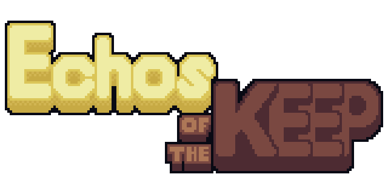

[
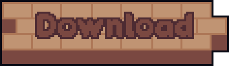
](https://vlcrngh.itch.io/echos-of-the-keep)
[
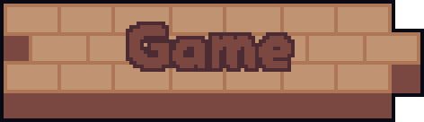
](https://vlcrngh.itch.io/echos-of-the-keep)
## Your greatest ally is your own shadow. Your greatest obstacle too. A minimalist and surgical puzzle game made for the Restless Jam.  In Echoes of the Keep, you control a mysterious archer trapped in an ancient tower filled with old machinery. To escape, you have only one power: Mimicry. By firing your magic arrow, you create a Clone exactly where it hits. From that moment on, it mimics your every move in real-time. Use the level architecture, wall corners, and your wits to synchronize your movements with your clone, activate simultaneous buttons, and clear your path to the exit.

  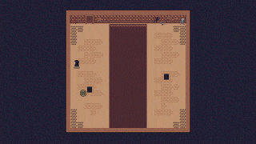

  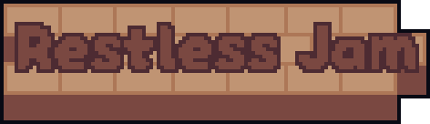

## This game was developed in 4 days for the Restless Jam, following the theme: 
 ### - Puzzle;  
 ### - Aim/Shoot 
 ### - Clones 
 ### - Environmental Storytelling
 ### - Incidental Soundtrack 
 ### - One action must serve multiple purposes

  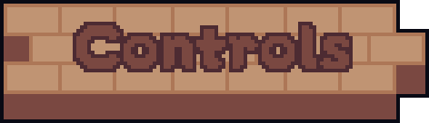
  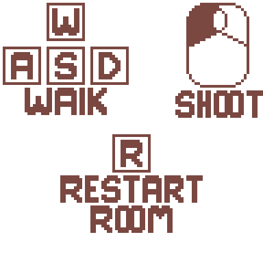

  

    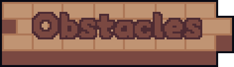
    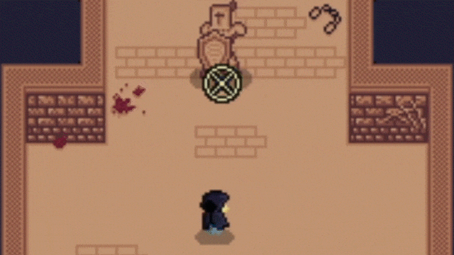

## To beat the challenges, you will need to master how these elements behave: 
### * Runic Plates: These only stay active while you or your clone are standing on them.  
### * Iron Gates: These open and close depending on which plates are currently pressed. Be careful ### not to lock your clone on the other side!  
### * The Abyss: Black voids in the ground that you cannot cross, but your arrow can fly over them ### to create a clone on the far side. 
### * Shielded Enemies: These guards block any arrows shot directly at their front. To defeat them ### or bypass them, you must use your clone to distract them or find a clever angle to hit them ### from behind where they are completely vulnerable!

    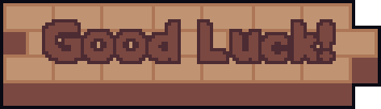
    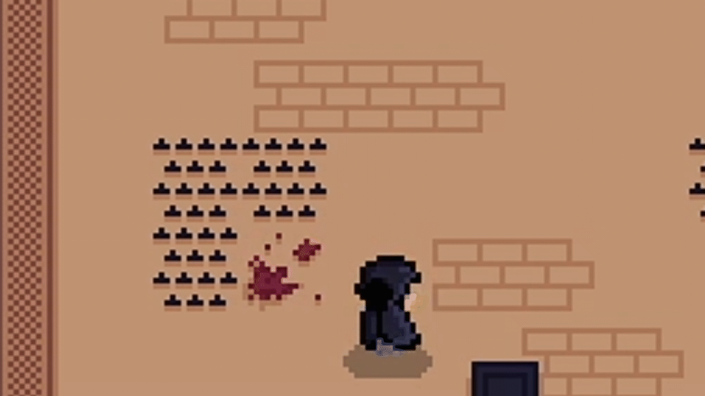

  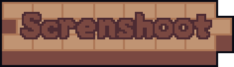

  
  
  
  

    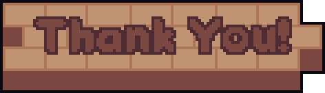

